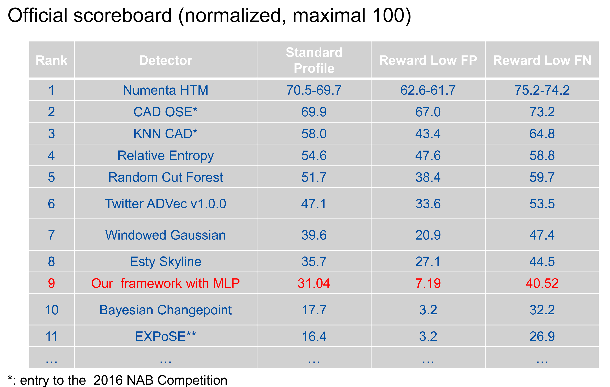
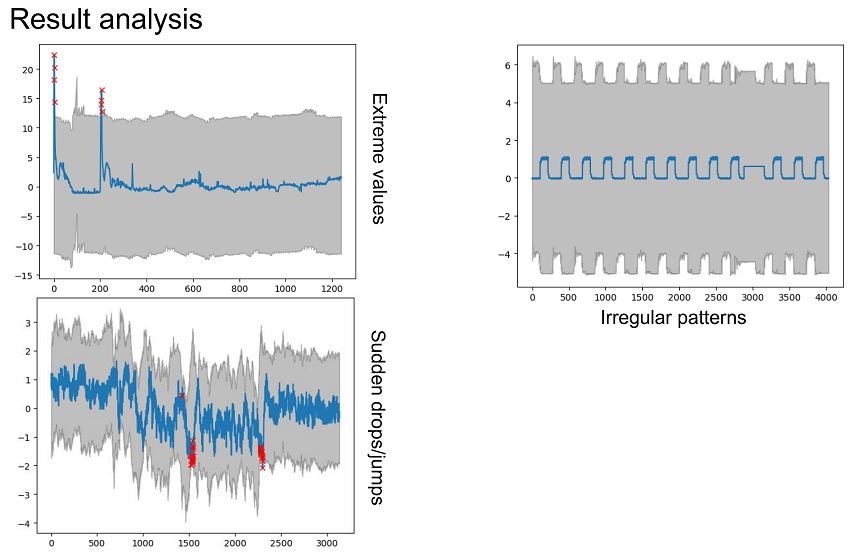

# Unsupervised-Online-Deep-Learning-Framework-for-Anomaly-Detection-in-Time-Series-
Unsupervised deep learning framework with both online(MLP: prediction-based, 1 D Conv and VAE: reconstruction-based, Wavenet: prediction-based) settings for anaomaly detection in time series data

## Anomaly detection in time series data
There are several common difficulties for anomaly detection in time series data:
* Unbalanced data set: referring to the definition of anomaly, the anomaly data should always be the minority among the full data set as well as sampled. Indeed, the anomaly data are very rare in reality, forming together with the major normal data an extreme
unbalanced set.
* Sparse labels: on the one hand, the labels denoting whether an instance is normal or anomalous is in many applications time-consuming and prohibitively expensive to obtain. This is especially typical for time series data, where the sampling frequency could reach 1000 Hz or the time could range over decades, generating an enormous amount of data points. On the other hand, anomalous data is often not reproducible and fully concluded in reality. For example, a failure in the electronics of a sensor would arise an anomalous signal but another kind of failure may very likely cause new form of anomalous signal. In some area, anomalous instances could be fatal and hence extremely
rare.
* Concept drift: this phenomenon usually occurs in time series data, where the common i.i.d. assumption for machine learning models is often violated due to the varying latent conditions. In [4] it is defined: Patterns and relations in such data often evolve over time, thus, models built for analyzing such data quickly become obsolete over time. In machine learning and data mining this phenomenon is referred to as concept drift.

To tackle the concept drift problem in the time series data, i also employ the idea of online training. That is to say, the model is trained and generates outputs continuously with only a couple of examples once along the time axis, which enables an adaption on the
varying streaming data. The target data of this framework is like in the most situations lack of labels for anomalousc examples, and is unbalanced towards a large amount of normal points as well as a drifted distribution along the time axis.

## Unspupervised learning

Approach with unsupervised learning: without giving any label for normal or abnormal examples, the anomaly detection problem is formulated in another way: either by re-constructing the given input or predicting unseen examples given only part of the data set, a sequence of errors between the original data set and generated data set could be acquired. Then based on these errors, anomaly scores could be calculated via e.g. mean square errors.

Among these unsupervised methods, two main approaches are to be implemented and investigated, namely prediction-based and
reconstruction-based anomaly detection in times series data:

* Prediction-based method: the models are given a segment of time series data, and the
output shall be the predicted value of next few successive points based on the previous
segment.
* reconstruction-based method: Techniques such as auto-encoding or Principal Compo-
nent Analysis first map the input data to a lower-dimensional space and then try to
reconstruct it again without losing the main information.

## Main Files

**Model.py**

In the **online** settings, the time series data are divided into fixed-sized segments, and each segment is seen as an exmple:

* **Multilayer Perceptron(MLP)**: predict the next elements based on the previous segment
* **1 D Convolutional Auto-encoder**: reconstruct the given segment as input
* **Variational 1D Convolutional Auto-encoder**: reconstruct the given segment as input

In the **seq2seq** settings,  following sequence to sequence models are employed to do the so-called iterative inference, that is to say, predict only one step ahead in an iteration, and with the predicted point added to the input, move to the next iteration:
* **Wavenet** 
* **LSTM**

**search_hyperparameters.py**

The Hyperparameters are all saved in a json file, in order to configure and record the hyperparameter settings for one expreriment automatically and efficiently. In addition, a Parameter class is created, so that at each iteration of the grid search, the settings could be updated and saved into a related json file, under the test subdirectory. Take a look at the code for details.

**metrics_aggregation.py**

In order to have an overview of the experiments results with different hyperparameter settings, the variants of one hyperparamter are compared via one or more user-defined metrics. And this file helps to aggregate these results automatically during grid search, creating a table summerizing the metrics values.

## Test on NAB dataset
See details about Numenta-Anomaly-Benchmark [NAB dataset](https://numenta.com/machine-intelligence-technology/numenta-anomaly-benchmark/)

